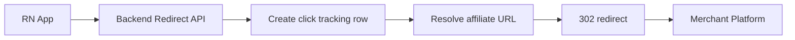

# React Native Price Comparison Backend Architecture

## 0. Locked Assumptions
- Runtime and framework: Bun + Elysia
- API base path: /api/v1
- Response envelope for all endpoints: success, data, error, meta
- Primary launch market: India with INR defaults
- Multi-country ready: every pricing and search surface carries country_code and currency_code
- Backend deployment: Coolify on Hetzner with 2 servers
  - Server A: API + Redis + BullMQ workers
  - Server B: PostgreSQL + Meilisearch + optional scraper workers

---

## 1. PostgreSQL Schema

### 1.1 Shared Postgres Types
- id fields: uuid for identity tables, bigint for high-volume event tables
- timestamps: timestamptz
- money fields: numeric 12,2
- enums:
  - platform_id: amazon, flipkart, croma, myntra, tatacliq
  - availability_status: in_stock, out_of_stock, pre_order, unknown
  - offer_type: coupon, instant_discount, bank_offer, cashback
  - notification_type: price_drop, deal_alert, generic
  - notification_status: queued, sent, failed, read
  - click_source: search, product, deals, similar, share, notification
  - admin_role: super_admin, catalog_manager, deals_manager, support_viewer

### 1.2 Table: users
Columns:
- id uuid primary key default gen_random_uuid
- clerk_user_id text not null unique
- phone_e164 text unique
- email text unique
- full_name text
- avatar_url text
- country_code char 2 not null default IN
- preferred_currency char 3 not null default INR
- expo_push_token text
- is_active boolean not null default true
- last_login_at timestamptz
- created_at timestamptz not null default now
- updated_at timestamptz not null default now
- deleted_at timestamptz

Indexes:
- unique clerk_user_id
- unique phone_e164
- unique email
- btree country_code, preferred_currency
- partial index active users on is_active true

### 1.3 Table: admin_users
Columns:
- id uuid primary key default gen_random_uuid
- user_id uuid not null unique references users id on delete cascade
- role admin_role not null
- permissions jsonb not null default empty object
- is_enabled boolean not null default true
- created_at timestamptz not null default now
- updated_at timestamptz not null default now

Indexes:
- unique user_id
- btree role
- btree is_enabled

### 1.4 Table: products
Columns:
- id uuid primary key default gen_random_uuid
- slug text not null unique
- title text not null
- normalized_title text not null
- brand text
- category text
- subcategory text
- description text
- specs jsonb not null default empty object
- hero_image_url text
- country_code char 2 not null default IN
- is_active boolean not null default true
- meili_document_id text unique
- created_at timestamptz not null default now
- updated_at timestamptz not null default now

Indexes:
- unique slug
- btree brand, category
- gin on specs
- btree normalized_title
- btree is_active, country_code

### 1.5 Table: product_variants
Columns:
- id uuid primary key default gen_random_uuid
- product_id uuid not null references products id on delete cascade
- variant_slug text not null unique
- title text not null
- storage_gb int
- color text
- size text
- model_number text
- gtin text
- attributes jsonb not null default empty object
- image_url text
- is_active boolean not null default true
- created_at timestamptz not null default now
- updated_at timestamptz not null default now

Indexes:
- btree product_id
- unique variant_slug
- btree product_id, is_active
- gin attributes
- btree storage_gb, color

### 1.6 Table: platform_prices
Columns:
- id bigint generated always as identity primary key
- variant_id uuid not null references product_variants id on delete cascade
- platform_id platform_id not null
- platform_sku text not null
- product_url text not null
- affiliate_url text
- currency_code char 3 not null
- mrp numeric 12,2
- selling_price numeric 12,2 not null
- shipping_cost numeric 12,2 default 0
- discount_percent numeric 5,2
- availability availability_status not null default unknown
- seller_name text
- rating numeric 3,2
- review_count int
- fetched_at timestamptz not null
- expires_at timestamptz not null
- source text not null
- raw_payload jsonb
- is_active boolean not null default true
- created_at timestamptz not null default now

Constraints:
- unique variant_id, platform_id, platform_sku, fetched_at
- check selling_price >= 0
- check currency_code length = 3

Indexes:
- btree variant_id, platform_id, fetched_at desc
- btree expires_at
- btree platform_id, is_active
- btree variant_id, selling_price
- partial index on active available rows where is_active true and availability = in_stock

### 1.7 Table: offers_coupons
Columns:
- id uuid primary key default gen_random_uuid
- platform_id platform_id not null
- title text not null
- description text
- offer_type offer_type not null
- coupon_code text
- discount_value numeric 12,2
- min_order_value numeric 12,2
- max_discount numeric 12,2
- terms text
- start_at timestamptz
- end_at timestamptz
- deeplink_url text
- applicable_product_id uuid references products id on delete set null
- applicable_variant_id uuid references product_variants id on delete set null
- is_verified boolean not null default false
- is_active boolean not null default true
- created_by_admin_id uuid references admin_users id on delete set null
- created_at timestamptz not null default now
- updated_at timestamptz not null default now

Indexes:
- btree platform_id, is_active
- btree start_at, end_at
- btree applicable_product_id
- btree applicable_variant_id
- btree coupon_code

### 1.8 Table: wishlist
Columns:
- id bigint generated always as identity primary key
- user_id uuid not null references users id on delete cascade
- variant_id uuid not null references product_variants id on delete cascade
- created_at timestamptz not null default now

Constraints:
- unique user_id, variant_id

Indexes:
- btree user_id, created_at desc
- btree variant_id

### 1.9 Table: search_history
Columns:
- id bigint generated always as identity primary key
- user_id uuid references users id on delete cascade
- query_raw text not null
- query_normalized text not null
- country_code char 2 not null default IN
- currency_code char 3 not null default INR
- result_count int not null default 0
- selected_product_id uuid references products id on delete set null
- session_id uuid
- searched_at timestamptz not null default now
- metadata jsonb not null default empty object

Indexes:
- btree user_id, searched_at desc
- btree query_normalized, searched_at desc
- btree country_code, currency_code, searched_at desc

### 1.10 Table: search_popularity
Columns:
- id bigint generated always as identity primary key
- query_normalized text not null
- country_code char 2 not null
- currency_code char 3 not null
- search_count bigint not null default 0
- weighted_score numeric 14,4 not null default 0
- last_searched_at timestamptz not null default now
- last_warm_at timestamptz
- top_product_id uuid references products id on delete set null
- created_at timestamptz not null default now
- updated_at timestamptz not null default now

Constraints:
- unique query_normalized, country_code, currency_code

Indexes:
- btree weighted_score desc
- btree search_count desc
- btree last_searched_at desc

### 1.11 Table: click_tracking
Columns:
- id bigint generated always as identity primary key
- click_id uuid not null unique
- user_id uuid references users id on delete set null
- session_id uuid
- platform_id platform_id not null
- product_id uuid references products id on delete set null
- variant_id uuid references product_variants id on delete set null
- platform_price_id bigint references platform_prices id on delete set null
- source click_source not null
- outbound_url text not null
- final_affiliate_url text not null
- country_code char 2 not null default IN
- currency_code char 3 not null default INR
- device_os text
- app_version text
- ip_hash text
- user_agent text
- redirect_status_code int
- clicked_at timestamptz not null default now
- metadata jsonb not null default empty object

Indexes:
- unique click_id
- btree clicked_at desc
- btree platform_id, clicked_at desc
- btree product_id, clicked_at desc
- btree user_id, clicked_at desc

### 1.12 Table: notifications
Columns:
- id bigint generated always as identity primary key
- user_id uuid not null references users id on delete cascade
- type notification_type not null
- title text not null
- body text not null
- payload jsonb not null default empty object
- channel text not null default expo
- status notification_status not null default queued
- sent_at timestamptz
- read_at timestamptz
- created_at timestamptz not null default now

Indexes:
- btree user_id, created_at desc
- btree status, created_at desc
- btree type, created_at desc

---

## 2. Redis Cache Strategy

### 2.1 Key Naming
- product detail: product:{productId}:{country}:{currency}
- variants list: product_variants:{productId}:{country}:{currency}
- variant prices sorted: variant_prices:{variantId}:{country}:{currency}
- search results: search:{country}:{currency}:{normalizedQuery}:p{page}:l{limit}:s{sort}
- search suggestions: suggest:{country}:{normalizedPrefix}
- deals page: deals:{country}:{currency}:p{page}:l{limit}
- similar products: similar:{productId}:{country}:{currency}
- offers list: offers:{platform}:{country}:{currency}
- wishlist: wishlist:{userId}
- redirect short-lived payload: redirect_ctx:{clickId}
- search hotset zset: search_hotset:{country}:{currency}

Example key:
- prices:amazon:iphone-15:128gb:black is represented as variant_prices:{variantId}:IN:INR with platform-specific entries in payload

### 2.2 TTL Policy
- search results: 900 seconds
- suggestions: 1800 seconds
- product detail: 3600 seconds
- variant prices: 1200 seconds
- offers: 1800 seconds
- deals page: 900 seconds
- similar products: 1800 seconds
- wishlist cache: 600 seconds
- redirect_ctx: 300 seconds

### 2.3 Invalidation Rules
- on platform_prices upsert for variant: delete variant_prices and dependent product search keys via key tags
- on offers change: delete offers and deals keys for affected platform and country
- on product or variant update: delete product, variants, search, similar keys
- on wishlist mutation: delete wishlist user key

### 2.4 Warm Cache Logic
- every 30 minutes BullMQ job reads top 100 entries from search_popularity weighted_score
- rebuild key set:
  - search keys for p1 l20 default sort relevance
  - product and variant price keys for top product hits
- update search_popularity.last_warm_at
- record job metrics: warmed_count, misses, failed_queries

---

## 3. Full API Contract

### 3.1 Standard Envelope
- success: boolean
- data: object or array or null
- error: null or object with code, message, details
- meta: requestId, timestamp, pagination, cache

### 3.2 Global Error Codes
- AUTH_REQUIRED 401
- AUTH_FORBIDDEN 403
- VALIDATION_ERROR 422
- RESOURCE_NOT_FOUND 404
- CONFLICT 409
- RATE_LIMITED 429
- UPSTREAM_UNAVAILABLE 503
- INTERNAL_ERROR 500

### 3.3 Auth
1) POST /api/v1/webhooks/clerk
- Auth: Clerk signature header verification
- Body: Clerk user event payload
- Action: upsert users by clerk_user_id
- Response data: received true, processed true
- Errors: 400 invalid signature, 422 malformed payload

2) POST /api/v1/auth/logout
- Auth: required user token
- Body: optional device token to revoke
- Response data: loggedOut true
- Errors: 401

### 3.4 Search
1) GET /api/v1/search
- Auth: optional
- Query: q, country default IN, currency default INR, page default 1, limit default 20, sort relevance|price_asc|price_desc
- Cache: search key lookup, fallback Meilisearch, write-through Redis
- Response data: items product summary list, facets, total
- Errors: 422, 503

2) GET /api/v1/search/suggestions
- Auth: optional
- Query: q, country
- Cache: suggest key with 30 min ttl
- Response data: suggestions array
- Errors: 422

### 3.5 Products and Variants
1) GET /api/v1/products/:productId
- Auth: optional
- Response data: product detail
- Errors: 404

2) GET /api/v1/products/:productId/variants
- Auth: optional
- Response data: variants array
- Errors: 404

3) GET /api/v1/variants/:variantId
- Auth: optional
- Response data: variant detail
- Errors: 404

### 3.6 Price Comparison
1) GET /api/v1/variants/:variantId/prices
- Auth: optional
- Query: country, currency, in_stock_only default true
- Response data: prices sorted by effective total selling_price plus shipping
- Errors: 404, 503

### 3.7 Offers and Coupons
1) GET /api/v1/offers
- Auth: optional
- Query: platform optional, productId optional, page, limit
- Response data: offers list
- Errors: 422

2) GET /api/v1/offers/:offerId
- Auth: optional
- Response data: offer detail
- Errors: 404

### 3.8 Wishlist
1) POST /api/v1/wishlist
- Auth: required
- Body: variantId
- Response data: added true
- Errors: 401, 404, 409

2) DELETE /api/v1/wishlist/:variantId
- Auth: required
- Response data: removed true
- Errors: 401, 404

3) GET /api/v1/wishlist
- Auth: required
- Query: page, limit
- Response data: saved variants with best current price
- Errors: 401

### 3.9 Deals
1) GET /api/v1/deals
- Auth: optional
- Query: country, currency, page, limit, platform optional
- Response data: deal cards with discount and offer tags
- Errors: 422

### 3.10 Similar Products
1) GET /api/v1/products/:productId/similar
- Auth: optional
- Query: limit default 10
- Response data: similar product array
- Errors: 404

### 3.11 Share Affiliate Link
1) POST /api/v1/share/affiliate-link
- Auth: optional
- Body: platformId, productId, variantId optional, source default share
- Response data: shareUrl, expiresAt
- Errors: 404, 422

### 3.12 Click Tracking Redirect
1) GET /api/v1/redirect/:platformId/:productId
- Auth: optional
- Query: variantId optional, priceId optional, source, sid session id
- Flow: create click_tracking row then 302 redirect to final_affiliate_url
- Response: HTTP 302
- Errors: 404 when product or platform mapping missing

### 3.13 Notifications
1) POST /api/v1/notifications/device-token
- Auth: required
- Body: expoPushToken
- Action: store token in users.expo_push_token
- Response data: saved true
- Errors: 401, 422

2) GET /api/v1/notifications
- Auth: required
- Query: page, limit, unread_only optional
- Response data: notification list
- Errors: 401

3) POST /api/v1/notifications/:id/read
- Auth: required
- Response data: updated true
- Errors: 401, 404

4) POST /api/v1/admin/notifications/send
- Auth: admin required
- Body: target userIds or segment filter, title, body, payload
- Response data: queuedCount
- Errors: 401, 403, 422

### 3.14 Admin Product CRUD
1) POST /api/v1/admin/products
2) GET /api/v1/admin/products/:id
3) PATCH /api/v1/admin/products/:id
4) DELETE /api/v1/admin/products/:id
- Auth: admin required
- Body fields: title, slug, brand, category, specs, images, is_active
- Errors: 401, 403, 404, 409, 422

### 3.15 Admin Deals CRUD
1) POST /api/v1/admin/deals
2) GET /api/v1/admin/deals/:id
3) PATCH /api/v1/admin/deals/:id
4) DELETE /api/v1/admin/deals/:id
- Auth: admin required
- Body fields: offer and display metadata
- Errors: 401, 403, 404, 422

### 3.16 Admin Dashboard
1) GET /api/v1/admin/dashboard/stats
- Auth: admin required
- Response data:
  - totalUsers
  - activeUsers7d
  - totalProducts
  - trackedClicks24h
  - topSearches
  - topPlatformsByClicks
- Errors: 401, 403

### 3.17 Search History
1) GET /api/v1/search-history
- Auth: required
- Query: limit default 20
- Response data: recent search list by user

2) POST /api/v1/search-history
- Auth: required
- Body: query, selectedProductId optional, resultCount
- Response data: recorded true

3) DELETE /api/v1/search-history/:id
- Auth: required
- Response data: deleted true

---

## 4. Third Party Integrations

### 4.1 Amazon PA-API 5.0
- Use signed requests with access key, secret, partner tag
- Fetch by ASIN mapped in platform_prices.platform_sku
- Pull fields: title, images, offers price, availability
- Throttle control with BullMQ queue per platform and rate limiter
- Store raw payload in platform_prices.raw_payload for audit and fallback parsing

### 4.2 Flipkart Affiliate API
- Use affiliate token headers
- Scheduled fetch by category and mapped product ids
- Normalize to platform_prices shape
- Retry with exponential backoff on 429 and 5xx

### 4.3 Croma, Myntra, Tata Cliq Scraping
- Worker-based scraping pipeline
- Respect robots and legal boundaries; only public product pages
- Use rotating user agents and bounded concurrency
- Parse price, availability, seller, rating
- Quality gate: reject stale scrape older than configured max age
- Persist raw HTML hash for change detection and parser drift alert

### 4.4 Clerk
- Client auth handled in app
- Backend verifies Clerk JWT on protected routes
- Webhook sync for user create update delete to users table
- Webhook signature verification mandatory

### 4.5 MSG91
- Fallback OTP path only when Clerk phone verification unavailable
- Endpoint can issue and verify OTP with short expiry
- Store only hash and metadata, never plain OTP

### 4.6 Expo Push Notifications
- Store token via notifications device-token endpoint
- Queue outbound notifications to BullMQ
- Send via Expo API chunked batches
- Update notifications.status and error details on delivery result

### 4.7 AdMob Backend Tracking
- Ads rendered in frontend
- Optional backend event endpoint for impression and click analytics attribution
- If enabled, store lightweight aggregate metrics only

---

## 5. BullMQ Job Definitions

1) warm-cache-refresh
- Trigger: cron every 30 min
- Input: country, currency, topN default 100
- Steps: read search_popularity, rebuild search and price caches
- Retries: 3 with exponential backoff
- Idempotency key: warm:{country}:{currency}:{window_start}

2) price-refresh-on-expiry
- Trigger: on cache miss or nearing expires_at threshold
- Input: variantId and platform list
- Steps: fetch upstream prices, upsert platform_prices, invalidate cache
- Retries: 5 with jitter
- Idempotency key: price:{variantId}:{platform}:{minute_bucket}

3) push-notification-dispatcher
- Trigger: queued notification event
- Input: notification id list or segment rule
- Steps: resolve tokens, send Expo chunks, persist sent or failed state
- Retries: 5
- Dead letter queue: notifications-dlq

4) click-tracking-flush
- Trigger: every 1 min and buffer threshold
- Input: buffered click events from Redis list or stream
- Steps: batch insert into click_tracking
- Retries: 4
- Idempotency key: click_batch:{batch_id}

Observability for all jobs:
- Metrics: queued, processed, failed, duration p95
- Structured logs with requestId and jobId
- Alert when fail rate exceeds threshold

---

## 6. Affiliate Link System

URL structure:
- Redirect endpoint: /api/v1/redirect/:platformId/:productId
- Optional query: variantId, priceId, source, sid, campaign, ref

Tracking flow:
1) Client taps Grab Deal
2) App opens backend redirect URL
3) Backend resolves best active affiliate URL
4) Backend writes click_tracking row with click_id
5) Backend appends subid or click_id in outbound affiliate query when platform supports it
6) Backend returns HTTP 302 to merchant URL

Mermaid flow:

---

## 7. Elysia Folder Structure

- src
  - app.ts
  - server.ts
  - config
    - env.ts
    - constants.ts
  - plugins
    - auth.plugin.ts
    - db.plugin.ts
    - redis.plugin.ts
    - queue.plugin.ts
    - meili.plugin.ts
  - routes
    - auth.routes.ts
    - search.routes.ts
    - products.routes.ts
    - prices.routes.ts
    - offers.routes.ts
    - wishlist.routes.ts
    - deals.routes.ts
    - similar.routes.ts
    - share.routes.ts
    - redirect.routes.ts
    - notifications.routes.ts
    - search-history.routes.ts
    - admin
      - products.admin.routes.ts
      - deals.admin.routes.ts
      - dashboard.admin.routes.ts
      - notifications.admin.routes.ts
  - services
    - auth.service.ts
    - search.service.ts
    - product.service.ts
    - pricing.service.ts
    - offers.service.ts
    - wishlist.service.ts
    - deals.service.ts
    - similar.service.ts
    - redirect.service.ts
    - tracking.service.ts
    - notification.service.ts
    - integrations
      - amazon.service.ts
      - flipkart.service.ts
      - croma.scraper.ts
      - myntra.scraper.ts
      - tatacliq.scraper.ts
      - clerk.service.ts
      - msg91.service.ts
      - expo.service.ts
  - jobs
    - index.ts
    - warm-cache.job.ts
    - price-refresh.job.ts
    - push-dispatch.job.ts
    - click-flush.job.ts
  - db
    - migrations
    - schema
      - users.sql
      - catalog.sql
      - pricing.sql
      - events.sql
    - repositories
      - users.repo.ts
      - products.repo.ts
      - prices.repo.ts
      - tracking.repo.ts
  - types
    - api.types.ts
    - db.types.ts
    - job.types.ts
    - integration.types.ts
  - utils
    - logger.ts
    - errors.ts
    - cache-keys.ts
    - validators.ts

---

## 8. Deployment Topology on 2 Hetzner Servers via Coolify
- Server A
  - Elysia API instances
  - Redis
  - Meilisearch
  - BullMQ workers
- Server B
  - PostgreSQL with daily backup and WAL archiving
  - Scraper worker pool optional
- Internal private network between servers
- TLS termination at Coolify ingress
- Health checks: api health, redis ping, db check, queue lag, meili search probe

This specification is implementation-ready for immediate execution in code mode.
